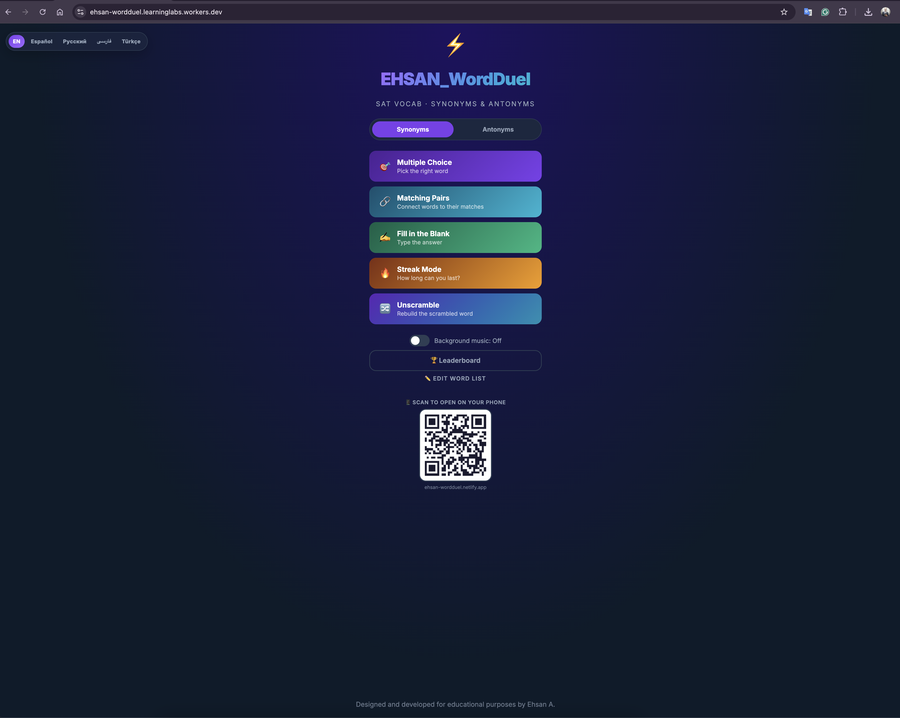
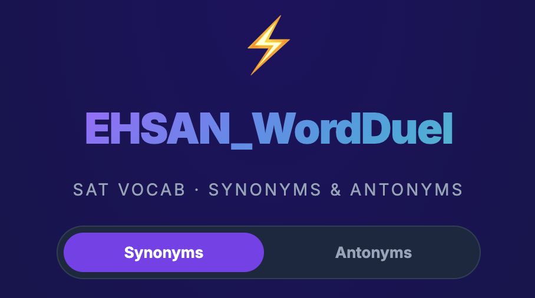
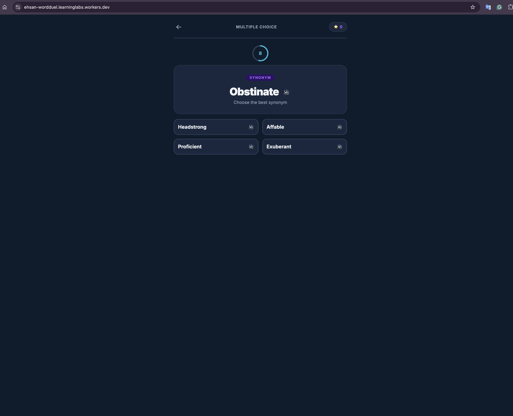
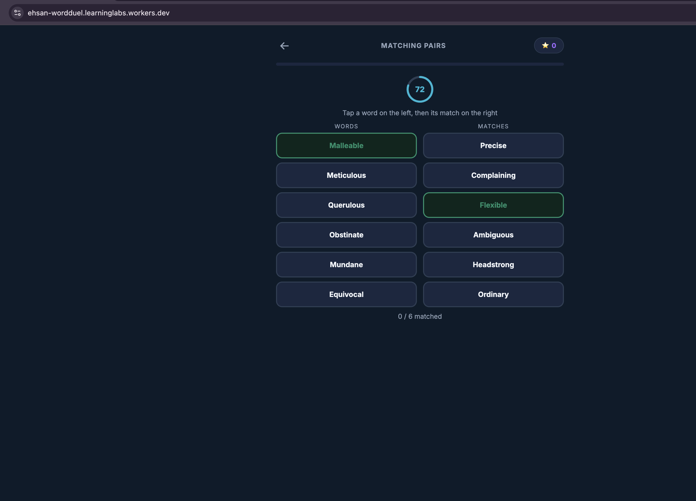
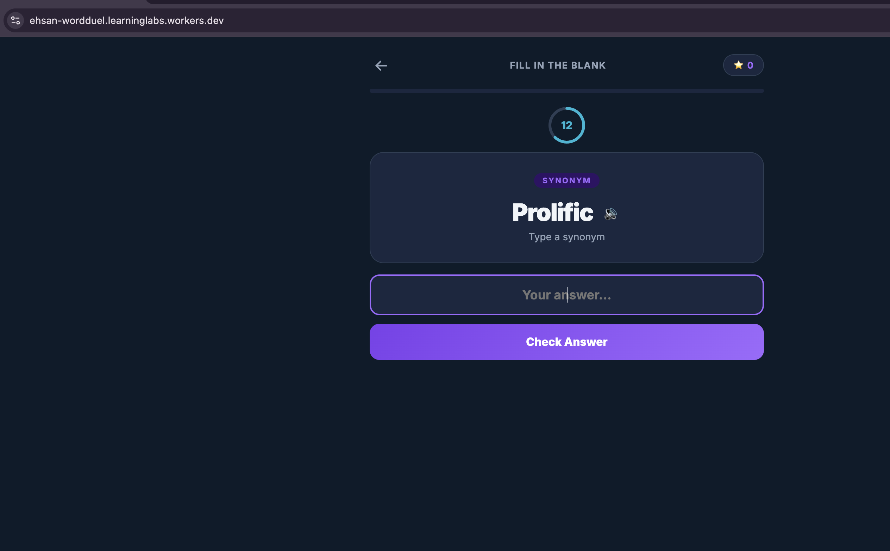
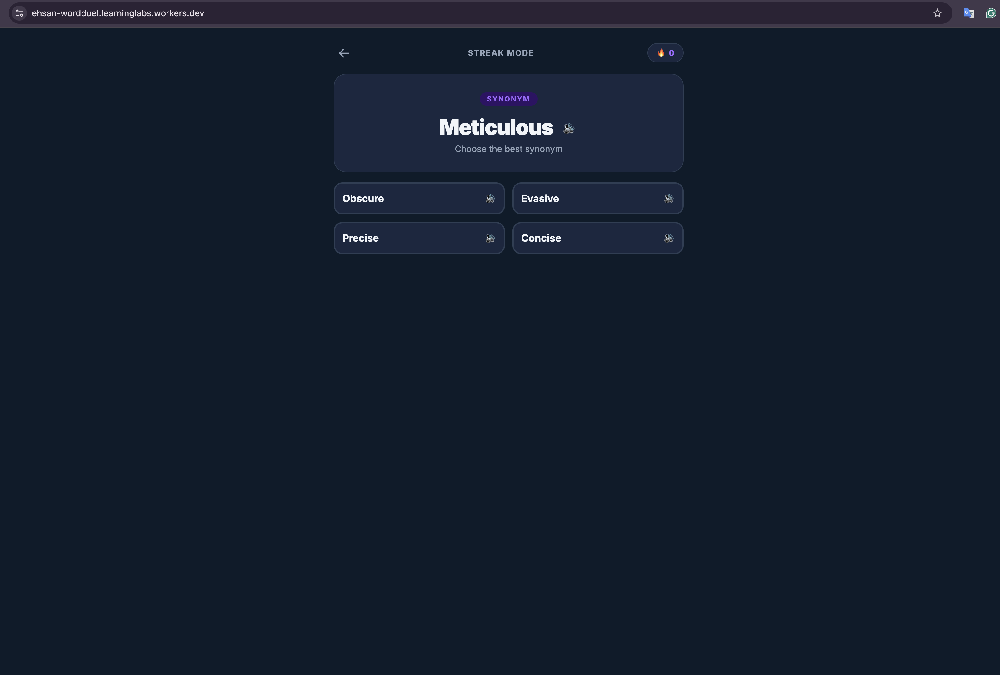
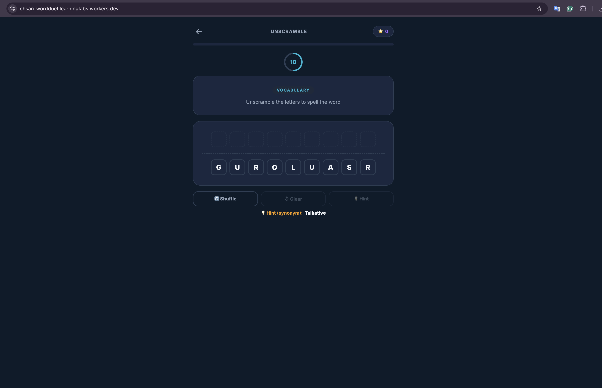
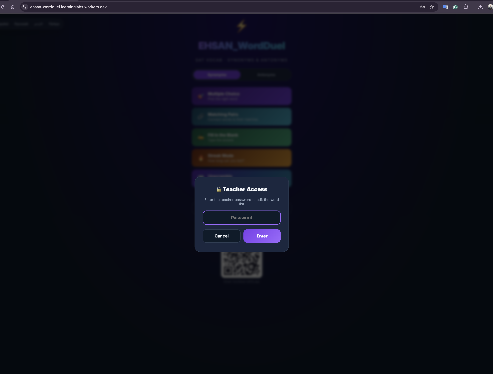
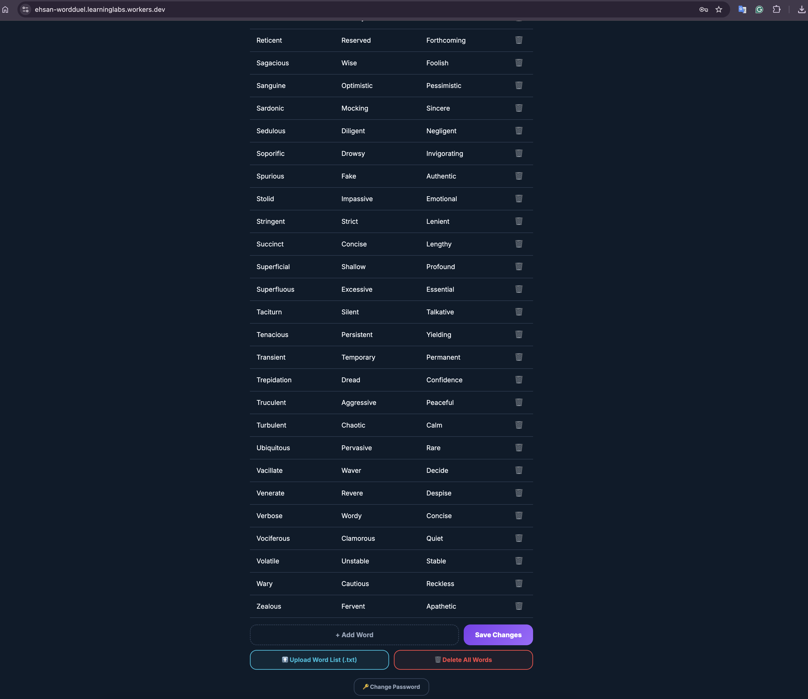

<div align="center">

# ⚡ EHSAN WordDuel

### SAT Vocabulary • Synonyms & Antonyms

An interactive vocabulary game that helps learners master English vocabulary through engaging challenges, active recall, and repetition.

<p>
  <a href="https://ehsan-wordduel.learninglabs.workers.dev"><strong>🎮 Play Live Demo</strong></a>
</p>

<p>
  
  
  
  
  
</p>



</div>

---

# 📖 About

**EHSAN WordDuel** is a browser-based educational vocabulary game designed to make learning English words both effective and enjoyable.

Instead of relying on traditional flashcards, learners strengthen their vocabulary through interactive game modes that reinforce **synonyms**, **antonyms**, **spelling**, **pronunciation**, and **active recall**.

The application runs entirely in the browser, requires no backend server, and stores all data locally.

---

# 🚀 Why WordDuel?

WordDuel transforms English vocabulary practice into an interactive learning experience. Multiple game modes, pronunciation support, multilingual navigation, and teacher tools keep learners engaged while reinforcing long-term memory through active recall and repetition.

---

# ✨ Features

- 🎯 SAT vocabulary practice
- 🎮 Five engaging game modes
- 🔊 Built-in pronunciation (Text-to-Speech)
- 🌍 Multilingual interface
- 👨‍🏫 Password-protected Teacher Mode
- 📥 Import vocabulary lists (.txt)
- ✏️ Edit vocabulary directly in the browser
- 🏆 Local leaderboard
- 💾 Automatic Local Storage saving
- 🎵 Optional background music
- 📱 Fully responsive design
- ☁️ Deployed on Cloudflare Workers

---

# 🎮 Game Modes

| Mode | Description |
|------|-------------|
| 🎯 Multiple Choice | Select the correct synonym or antonym before time runs out. |
| 🔗 Matching Pairs | Match vocabulary words with their meanings. |
| ✍️ Fill in the Blank | Type the correct answer. |
| 🔥 Streak Mode | Build the longest streak of correct answers. |
| 🔀 Unscramble | Reconstruct scrambled vocabulary words using optional hints. |

---

# 📸 Screenshots

Experience WordDuel through five engaging game modes, each designed to reinforce vocabulary using a different learning strategy.

## 🏠 Home Screen

The main menu provides quick access to every game mode, language selection, leaderboard, background music, and teacher tools.

<p align="center">
  
</p>

---

## 🎯 Multiple Choice

Choose the correct synonym or antonym before the timer expires.

<p align="center">
  
</p>

---

## 🔗 Matching Pairs

Match vocabulary words with their corresponding synonyms or antonyms.

<p align="center">
  
</p>

---

## ✍️ Fill in the Blank

Recall the correct word by typing the answer yourself.

<p align="center">
  
</p>

---

## 🔥 Streak Mode

Challenge yourself to answer as many questions correctly as possible without making a mistake.

<p align="center">
  
</p>

---

## 🔀 Unscramble

Reconstruct scrambled vocabulary words using your spelling knowledge and optional hints.

<p align="center">
  
</p>

---

## 🔐 Teacher Access

Teacher Mode is protected by a password to prevent unauthorized changes to the vocabulary database.

<p align="center">
  
</p>

---

## 📝 Vocabulary Editor

Teachers can add, edit, delete, and import vocabulary directly from the browser.

<p align="center">
  
</p>

---

# 🌍 Supported Languages

The interface is currently available in:

- 🇺🇸 English
- 🇪🇸 Español
- 🇷🇺 Русский
- 🇮🇷 فارسی
- 🇹🇷 Türkçe

The vocabulary itself remains in English so learners practice authentic English while using an interface in their preferred language.

---

# 👨‍🏫 Teacher Mode

Teacher Mode allows instructors to fully customize the learning experience.

### Features

- 🔐 Password-protected access
- ➕ Add new vocabulary
- ✏️ Edit existing words
- 🗑️ Delete vocabulary
- 📥 Import `.txt` vocabulary lists
- 🔑 Change the teacher password

All data is stored locally in the browser.

---

# 📄 Importing Vocabulary

Word lists can be imported from a simple text file.

Example:

```text
abandon     leave      keep
benevolent  kind       cruel
scarce      rare       abundant
```

Each row should contain:

```text
Word<TAB>Synonym<TAB>Antonym
```

---

# 🛠 Technology Stack

- HTML5
- CSS3
- Vanilla JavaScript
- Web Speech API
- Local Storage API
- QRCode.js
- Google Fonts (Inter)
- Cloudflare Workers

---

# 📂 Project Structure

```text
.
├── css/
├── docs/
│   └── images/
├── js/
├── index.html
├── README.md
└── LICENSE
```

---

# 🚀 Getting Started

Clone the repository:

```bash
git clone https://github.com/EAshourzadeh/ehsan-wordduel.git
```

Navigate to the project folder:

```bash
cd ehsan-wordduel
```

Serve locally:

```bash
python -m http.server
```

Open your browser:

```
http://localhost:8000
```

You can also simply open `index.html` directly in your browser.

---

# 💾 Data Storage

WordDuel stores all data locally using the browser's Local Storage.

This includes:

- Vocabulary database
- Leaderboard
- Teacher preferences
- Language settings
- Music preferences
- Game settings

No user accounts or external database are required.

---

# 🎯 Educational Goals

WordDuel helps learners improve:

- Vocabulary acquisition
- Synonym recognition
- Antonym recognition
- Spelling accuracy
- Pronunciation
- Long-term retention through active recall

Suitable for learners preparing for:

- SAT
- GRE
- TOEFL
- IELTS
- General English proficiency

---

# 🤝 Contributing

Contributions are welcome!

1. Fork the repository.
2. Create a feature branch.

```bash
git checkout -b feature/new-feature
```

3. Commit your changes.

```bash
git commit -m "Add new feature"
```

4. Push to your branch.

```bash
git push origin feature/new-feature
```

5. Open a Pull Request.

---

# 🌐 Live Demo

👉 **https://ehsan-wordduel.learninglabs.workers.dev**

---

# 👤 Author

**Ehsan Ashourzadeh**

Designed and developed for educational purposes.

GitHub: https://github.com/EAshourzadeh

---

# ⭐ Support

If you found this project useful, please consider:

- ⭐ Starring the repository
- 🍴 Forking the project
- 📢 Sharing it with other English learners

Your support helps improve the project and motivates future development.

---

<div align="center">

## Learn English. Play Smarter. Build Your Vocabulary.

Made with ❤️ for English learners worldwide.

</div>
